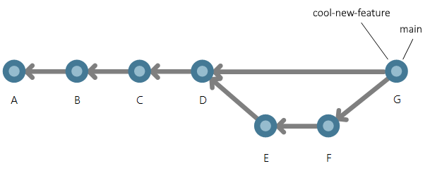

- [git](https://git-scm.com/) is an open-source version control system
- [GitHub](https://github.com/) is an online hosting service for git

## The git Sales Pitch

If you have ever done something like this:

```
myfile.txtrsion
myfile-v2.txt
myfile-v2a.txt
myfile-final.txt
myfile-final-real.txt
myfile-this-is-the-final-version-I-swear.txt
```

Then git is for you!

# The git explanation

git makes it easy to manage many versions of files within a project. git uses a system of commits and branches to accomplish this.

A commit is equivalent to saving a file. Once a file or set of files is committed, they are saved in the git system.
git creates a unique hash for each commit, so it can be returned to later. Without branches, this would work very similarly to the way the version history does in a word document. Useful, but maybe not life changing. Branches allow you to manage multiple _parallel_ versions simultaneously.


